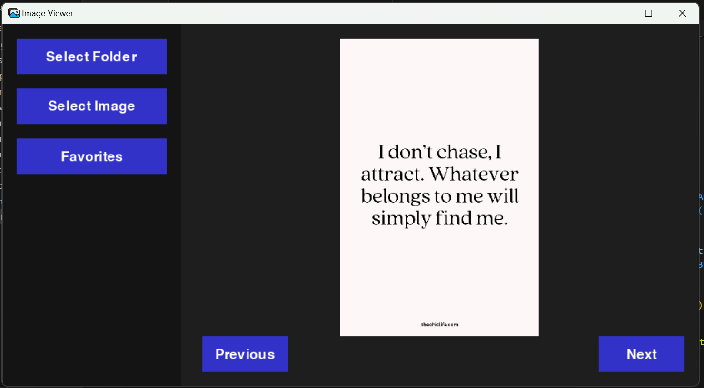
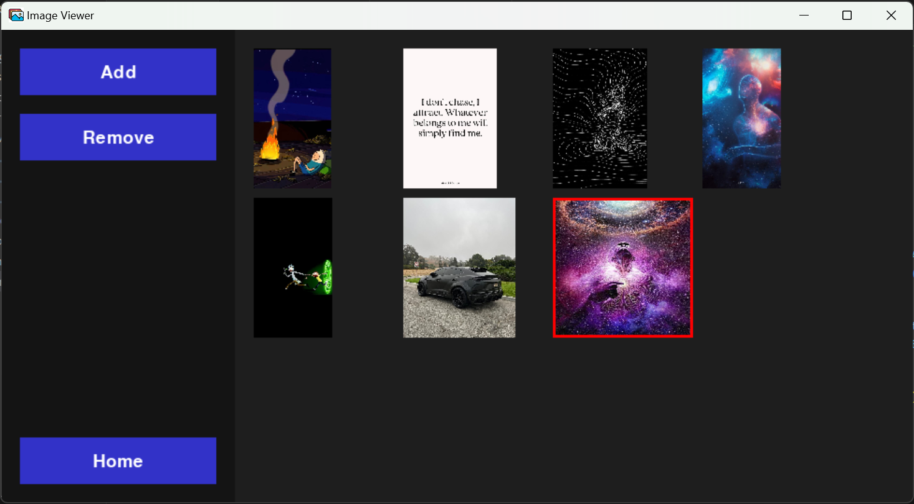

  

<h3 align="center">Image Viewr</h3>

---

Image Viewer that allows you to browse your images from a folder and be able to store your favourites
      

- [About](#about)
- [Prerequisites](#prerequisites)
- [Installing](#installing)
- [Running the Application](#tests)
- [Usage](#usage)
- [built_using](#built_using)
- [Authors](#authors)

## 🧐 About 
The Image Viewer is a simple yet effective desktop application designed for browsing images and managing a favorites collection. Built with Python, the app allows users to easily navigate through images and add their favorites for quick access. Currently, the app offers an intuitive interface to browse through directories and store favorite images. Additional features are being developed to further enhance the user experience, making it a versatile tool for managing image collections.

## Prerequisites 

Python: Make sure you have Python installed (usually version 3.x). 
Required Libraries:  
Tkinter (or any other GUI library like PyQt or wxPython) for building the user interface. 
PyGame

## 🔧 Running the application 

You can view your images from a specific folder on your computer
 
 

You can remove an image from favourites by clicking on it

## 🎈 Usage 

1. Go to the project folder
2. Open the main file
3. Run the main.py file with python

## ⛏️ Built Using 

- Python
- PyGame
- tkinter

## ✍️ Authors 

- Blessing Hlongwane
